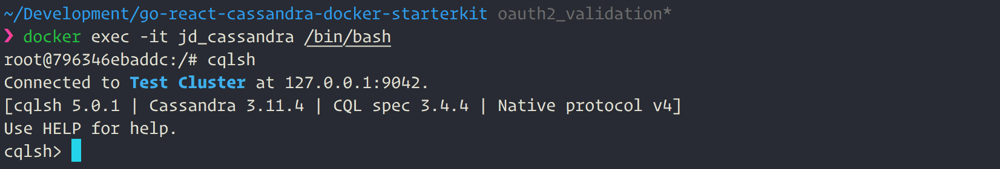

# Golang, React, Cassandra and Docker starter kit

Quick start the next application with the above technologies

## Getting Started

These instructions will get you a copy of the project up and running on your local machine for development and testing purposes. See deployment for notes on how to deploy the project on a live system.


```
TBD - Detailed instructions

```

### Prerequisites

Make sure that you have

[Docker]() installed and running

[Go](https://golang.org) installed and [GOPATH](https://github.com/golang/go/wiki/GOPATH) and [PATH](https://en.wikipedia.org/wiki/PATH_(variable)) configured correctly

```
Give examples
```

### Installing

A step by step series of examples that tell how to get a development env running

Make sure you have Docker running, then change to the root directory of the app and issue following command, to bring up the **Cassandra** in port **9042** with a **MAX_HEAP** **256M**
```
docker-compose -f docker-compose-cassandra.yml up
```
You can also use the following command incase you want to bring up **Cassandra** with bare minimum config

```
docker run -p 9042:9042 --rm --name jd_cassandra -d cassandra:latest
```

Once the container is up and running use the following command to connect to the container

```
docker exec -it jd_cassandra /bin/bash
```
Then issue `cqlsh` command at the prompt to connect to the Cassandra we jus brought into life. Your prompt should look like the following

Cassandra running in docker:


End with an example of getting some data out of the system or using it for a little demo

## Running the tests

Explain how to run the automated tests for this system

### Break down into end to end tests

Explain what these tests test and why

```
Give an example
```

### And coding style tests

Explain what these tests test and why

```
Give an example
```

## Deployment

Add additional notes about how to deploy this on a live system

## Built With

* [Gorilla](http://www.dropwizard.io/1.0.2/docs/) - The web framework used
* [Cassandra](https://maven.apache.org/) - Dependency Management
* [Docker](https://rometools.github.io/rome/) - Used to generate RSS Feeds
* [React](https://rometools.github.io/rome/) - Used to generate RSS Feeds
* [Create React App](https://rometools.github.io/rome/) - Used to generate RSS Feeds
* [Material UI for React](https://rometools.github.io/rome/) - Used to generate RSS Feeds

## Contributing

Please read [CONTRIBUTING.md] for details on our code of conduct, and the process for submitting pull requests to this repo.

## Versioning

We use [SemVer](http://semver.org/) for versioning. For the versions available, see the [tags on this repository](https://github.com/your/project/tags).

## Authors

* **Deepak Jacob** - (https://github.com/deepakjacob)

## License

This project is licensed under the MIT License - see the [LICENSE.md](LICENSE.md) file for details

## Acknowledgments

* TBD
