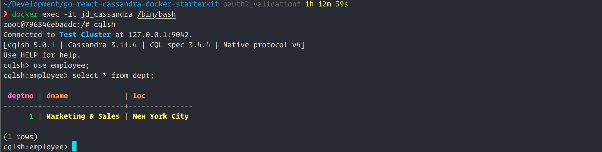

# Golang, React, Cassandra and Docker starter kit

Quick start the next application with the above technologies

## Getting Started

These instructions will get you a copy of the project up and running on your local machine for development and testing purposes. See deployment for notes on how to deploy the project on a live system.


### Prerequisites

Make sure that you have [Docker]() installed and running with [Go](https://golang.org) installed and [GOPATH](https://github.com/golang/go/wiki/GOPATH) and [PATH](https://en.wikipedia.org/wiki/PATH_(variable)) configured correctly

```
TODO: Give examples
```

### Installing

A step by step series of examples that tell how to get a development env running

Make sure you have Docker running, then change to the root directory of the app and issue following command, to bring up the **Cassandra** in **PORT** **9042** with a **MAX_HEAP** of **256M**

Clone the repo

```
$ git clone https://github.com/deepakjacob/go-react-cassandra-docker-starterkit
```
Chnage to the root of the project ```$ cd go-react-cassandra-docker-starterkit```

```
docker-compose -f docker-compose-cassandra.yml up
```
Contents of the file `docker-compose-cassandra.yml is are as follows:

```
version: '3'
services:
  cassandra00:
    container_name: cassandra00
    image: launcher.gcr.io/google/cassandra3
    ports:
      - '7000:7000'
      - '7001:7001'
      - '7199:7199'
      - '9042:9042'
      - '9160:9160'
    environment:
      - "MAX_HEAP_SIZE=1024M"
      - "HEAP_NEWSIZE=512M"
      - "CASSANDRA_BROADCAST_ADDRESS=127.0.0.1"
    volumes:
      - ./cassandra_data:/var/lib/cassandra

```
In the above configuration having `CASSANDRA_BROADCAST_ADDRESS` is very important. If this is not provided cluster creation will
take as much as `10 secs` :sweat:


You can also use the following command incase you want to bring up Cassandra with bare minimum config. Please note the the file `docker-compose-cassandra.yml` won't be used in this option and should be used just for testing.

```
docker run -p 9042:9042 --rm --name jd_cassandra -d cassandra:latest
```

Once the container is up and running use the following command to connect to the container
In the below example `jd_cassandra` is the name of the container.
```
docker exec -it jd_cassandra /bin/bash
```
Then issue `cqlsh` command at the prompt to connect to the Cassandra we jus brought into life. Your prompt should look like the following

Cassandra running in docker:


Also you can use `nodetool status` command to see the status of the cluster

To make the `cqlsh` completions work install [easy install](https://docs.datastax.com/en/cql/3.3/cql/cql_using/startCqlLinuxMac.html)

Once the above setup is done, next step is to create a `keyspace`, also note that we use same replication factor to the entire cluster

```
CREATE KEYSPACE IF NOT EXISTS employee WITH REPLICATION ={'class':'SimpleStrategy', 'replication_factor': 1};
```
The next step is to create a `emp` and `dept` tables under the keyspace created above

```
 use employee;

 CREATE TABLE dept(
    deptno int,
    dname text,
    loc text,
    PRIMARY KEY (deptno));

CREATE TABLE emp(
    empno    UUID,
    ename    text,
    job      text,
    mgr      UUID,
    hiredate date,
    sal      decimal,
    comm     decimal,
    deptno   int,
    primary key (empno));

INSERT INTO dept (deptno, dname, loc) VALUES (1, 'Marketing & Sales', 'New York City');

INSERT INTO emp (empno, ename, deptno, job, hiredate, mgr, sal, comm) VALUES (now(), 'KING', null, 'PRESIDENT', '2018-01-31', null, 5000, 10);
```

If everything go as expected we should be able to see the following output in console



## Running the tests

Explain how to run the automated tests for this system

### Break down into end to end tests

Explain what these tests test and why

```
Give an example
```

### And coding style tests

Explain what these tests test and why

```
Give an example
```

## Deployment

Add additional notes about how to deploy this on a live system

## Built With

* [Gorilla](http://www.dropwizard.io/1.0.2/docs/) - The web framework used
* [Cassandra](https://maven.apache.org/) - Dependency Management
* [Docker](https://rometools.github.io/rome/) - Used to generate RSS Feeds
* [React](https://rometools.github.io/rome/) - Used to generate RSS Feeds
* [Create React App](https://rometools.github.io/rome/) - Used to generate RSS Feeds
* [Material UI for React](https://rometools.github.io/rome/) - Used to generate RSS Feeds

## Contributing

Please read [CONTRIBUTING.md] for details on our code of conduct, and the process for submitting pull requests to this repo.

## Versioning

We use [SemVer](http://semver.org/) for versioning. For the versions available, see the [tags on this repository](https://github.com/your/project/tags).

## Authors

* **Deepak Jacob** - (https://github.com/deepakjacob)

## License

This project is licensed under the MIT License - see the [LICENSE.md](LICENSE.md) file for details

## Acknowledgments

* TBD
